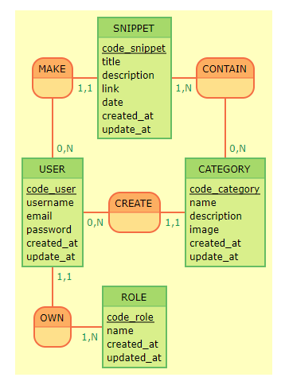
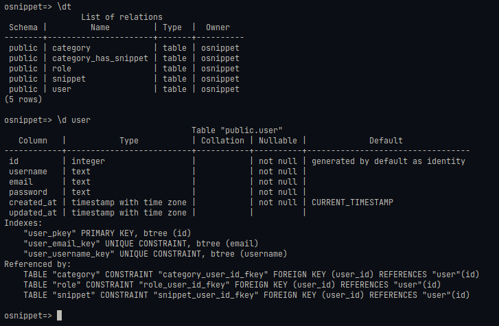

# START NEW PROJECT O'snippet

## Mise en place du MCD :

## Mise en place du MLD : 

    SNIPPET ( snippet_id, title, description, link, date, created_at, update_at, #user_id )
    USER ( user_id, username, email, password, created_at, update_at )
    CATEGORY ( category_id, name, description, image, created_at, update_at, #user_id )
    ROLE ( role_id, name, created_at, updated_at, #user_id )
    CONTAIN ( #category_id, #snippet_id )

## Mise en place du MPD :

## Création de la base de donnée

    --~ TABLE USER
    CREATE TABLE IF NOT EXISTS "user" (

        "id" INTEGER GENERATED BY DEFAULT AS IDENTITY PRIMARY KEY,
        "username" TEXT NOT NULL UNIQUE,
        "email" TEXT NOT NULL UNIQUE,
        "password" TEXT NOT NULL,
        "created_at" TIMESTAMPTZ NOT NULL DEFAULT CURRENT_TIMESTAMP,
        "updated_at" TIMESTAMPTZ 
    );

## Mise en place des Models et de leurs relations

Rajout de la valeur courante de chacune des séquence en selectionnant l'id max

*Postgres avec le fait d'ajouter IDENTITY BY DEFAULT au lieu de ALWAYS ne met pas à jour le curseur de l'incrément de la séquence de façon implicite !*

    SELECT setval('category_id_seq', (SELECT MAX(id) from "category"));
    SELECT setval('role_id_seq', (SELECT MAX(id) from "role"));
    SELECT setval('user_id_seq', (SELECT MAX(id) from "user"));
    SELECT setval('snippet_id_seq', (SELECT MAX(id) from "snippet"));
    SELECT setval('user_id_seq', (SELECT MAX(id) from "user"));