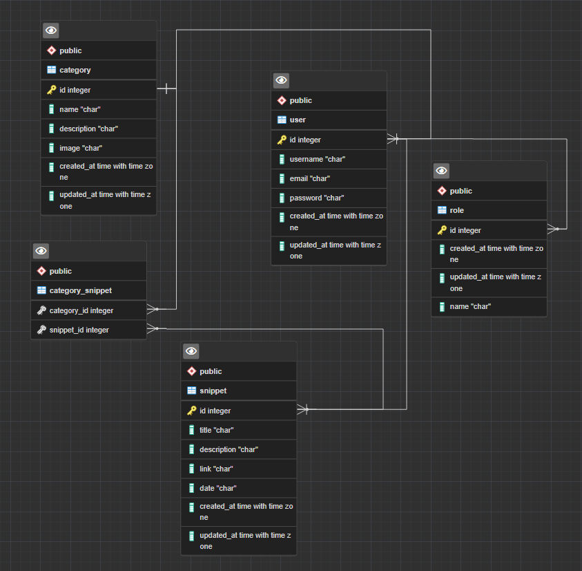

# START NEW PROJECT O'snippet

## Mise en place du MCD :

## Mise en place du MLD : 

    SNIPPET ( snippet_id, title, description, link, date, created_at, update_at, #user_id )
    USER ( user_id, username, email, password, created_at, update_at )
    CATEGORY ( category_id, name, description, image, created_at, update_at, #user_id )
    ROLE ( role_id, name, created_at, updated_at, #user_id )
    CONTAIN ( #category_id, #snippet_id )

## Mise en place du MPD :

## Création de la base de donnée